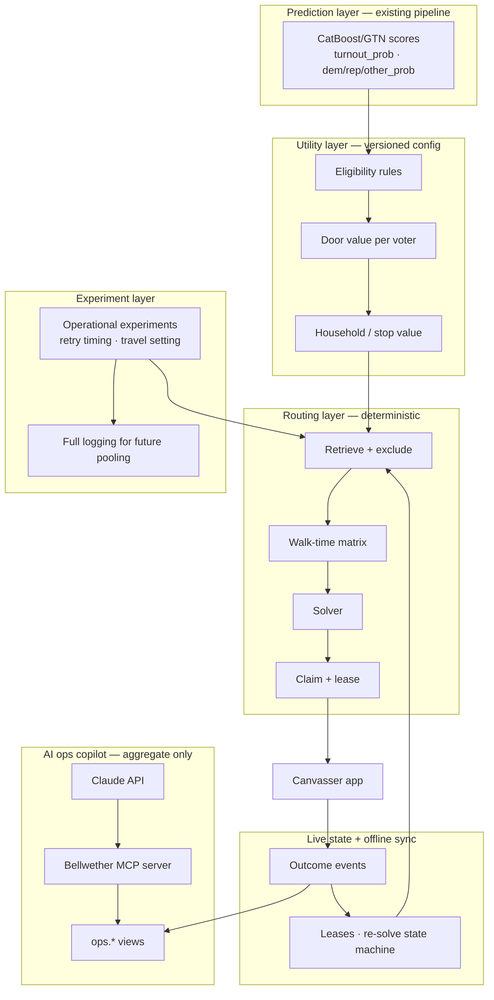

# Canvassing Mapping & Targeting — Design Spec v2

**Project:** DLFI Voting Project / Bellwether (Nassau & Suffolk, NY)
**Feature:** A canvasser starts a route from their location and gets an ordered, live-updating list of the next doors to knock. The feature works offline. Field directors get an AI ops copilot over aggregate field data.
**Status:** Design draft v2. It incorporates an adversarial review (mapped item by item in §16), a MiniVAN-derived outcome set, offline-first sync, and the AI ops copilot. All decisions #1–#14 are recorded in §15. #14 uses an interim default that the phase 4 sensitivity sweep replaces before the first real shift.
**Emphasis:** user experience and implementation. The scoring math is kept to what engineering needs, and every modeling assumption lives in a versioned config (§6), not in code.

---

## 1. What changed from v1

1. **The architecture now has four separate layers:** Prediction → Utility → Routing → Experiment, each with its own contract. The hand-built targeting weights are no longer hidden business logic inside the router.
2. **The outcome set** follows MiniVAN's field-tested "couldn't reach" reasons, with a re-knock rule for each.
3. **The app is offline-first.** It keeps a local store, an outbox with idempotent sync, a visible sync state, and can re-plan the route on the device.
4. **Live-state bugs are fixed:** claiming doors after solving, lease length vs. route length, re-solve triggers that contradicted each other, and a latency target that contradicted the solver budget.
5. **Door count and time budget are defined precisely.** Both are caps. The API example now respects the budget.
6. **Honest labels:** the GOTV weight is marked as a hypothesis, the "persuasion" weight is renamed *support uncertainty*, and OR-Tools is described as a time-boxed heuristic.
7. **Validation is scaled to reality.** At 2–3 small campaigns there is no turnout holdout. The evaluation relies on operational experiments (retry timing, travel settings), solver benchmarks and full logging for future pooling (§12).
8. **New sections:** AI ops copilot with MCP tools (§10) and a security threat model (§11).

---

## 2. Architecture



**Layer contracts:**

| Layer | Input | Output | How it is tested |
|---|---|---|---|
| Prediction | Voter features | Calibrated probabilities per voter | Calibration, Brier/log loss, out-of-time checks (§12.2) |
| Utility | Probabilities + `utility_config` version | Door value per voter, eligibility flag | Distribution and sensitivity reports. Every route is stamped with `utility_version`. |
| Routing | Values, locations, caps | Ordered stops | Operations-research benchmarks only (§12.3). Tells you nothing about whether the values are right. |
| Experiment | Retries, shifts, routes | Operational arm assignments and logs | Contact-rate and doors-per-hour comparisons. Turnout holdout deferred (§12.5). |

**Hard boundary:** no LLM anywhere in the prediction, utility, or routing path. The AI copilot (§10) reads only aggregate operational views and can't reach voter-level tables.

---

## 3. Users and journeys

| Role | Core job | Main surface |
|---|---|---|
| **Canvasser** (volunteer or staff) | Knock efficiently, record outcomes, never double-knock a teammate's door | Mobile app (§4) |
| **Field director** | Keep turfs on pace, fix problems (bad pins, sync failures, locked buildings), rebalance people | Web dashboard + AI ops copilot (§10) |
| **Campaign manager** | Plan coverage, choose the utility preset, review experiment design | Dashboard settings + aggregate reports |

**Canvasser happy path:** open app → **Start Route** (location + shift length) → work down **Next Door** → tap a door → record an outcome → the app advances automatically → repeat → **End Shift** (sync and wipe the cache).

---

## 4. Canvasser experience

The UI patterns follow MiniVAN: a map/list toggle, a household/people split, an outcome sheet, and a route timeline. Each screen below adds the fixes MiniVAN reviewers asked for.

### 4.1 Start Route sheet (new)

| Element | Behavior |
|---|---|
| **Location** | Taps "Use my location" (GPS), or types an address and drags the pin to correct it. If GPS accuracy is worse than 100 m, the app asks the canvasser to confirm the pin before planning. |
| **Shift length** | Slider from 30 to 240 minutes. Default 120. |
| **Door cap** | Optional stepper. Default 50. |
| **Preview** | Before committing: "About **34 doors** fit in 2 h · ~1.1 mi walking". This avoids promising 50 doors that won't fit. |
| **Mode chip** | Shows the campaign's utility preset, for example "GOTV broad (hypothesis v4)". Read-only for canvassers. |
| **Start** | Claims the route (§8.1) and opens Next Door. |

### 4.2 Next Door timeline

- A vertical timeline, as in MiniVAN: **Start at** the canvasser's location, then numbered stops with the walk distance to each and a people count (a building icon plus unit count for multi-unit stops).
- **Completed doors** get a check mark and collapse.
- **The next 3 doors are pinned.** Re-planning never reorders them (the stability horizon, §8.2). Doors beyond them may be re-planned, and the app says so with a small "Updated" chip rather than silently shuffling.
- **Teammate awareness:** if a teammate knocks one of your later doors, it disappears with a toast ("412 Elm knocked by a teammate") and the route re-plans. This fixes MiniVAN's most common complaint.
- **Actions:** Get Directions (opens Apple or Google Maps), Skip door (asks for a reason and counts as an invalidation event), End route.

### 4.3 Door detail

- Address, a street-view link, Get Directions, and the people at the address with **first name and last initial only**. Age, sex, and party registration are **off by default**. A **field director or campaign manager** can turn them on (decision #11). Scores are never shown.

  | Setting | Detail |
  |---|---|
  | Who can enable | Field director or campaign manager only. Canvassers can't change it. |
  | Scope | Campaign-wide, per team, or per canvasser. The narrowest setting wins, for example on for experienced team leads only. |
  | Fields | Each field is toggled separately: age (shown as an age band or exact age), sex, and party registration. |
  | Enforcement | Server-side. The API omits disabled fields from responses and from the offline cache, so a hidden field is never on the device. |
  | Audit | Every change records who, what, which scope and when, visible on the dashboard. |
  | Takes effect | At the canvasser's next sync or route refresh. Turning a field off also removes it from the offline cache. |
- One-tap **"Nobody home — whole household"**, plus per-person outcomes.
- **Report a pin problem:** "Pin is in the wrong place" or "Can't reach from here". This feeds the geocode QA queue (§5.2).
- **Request access** (buildings and group quarters): sends an access request to the field director. If the canvasser holds a grant, the door shows an "Access granted" chip plus the access notes (§5.1a).

### 4.4 Outcome sheet (adopted from MiniVAN)

**Contacted** has its own flow: talked to voter, plus optional script questions and notes. The **Couldn't reach** reasons each have a defined effect:

| Outcome | Scope | Re-knock rule (decided defaults, #6; re-tune from field logs) | Route effect |
|---|---|---|---|
| **Not Home** | Person or household | Re-eligible after a delay. Priority compounds down with each attempt: 1st retry at 70%, 2nd at 49%. Maximum 3 attempts. | Progression |
| **Come Back** | Person | The canvasser picks a time ("in 1 h", "evening", "weekend"). The door is re-eligible at that time with **full** priority. | Progression. Offered to this canvasser first if they're nearby. |
| **Day Sleeper** | Person or household | Re-eligible only after 4 pm, or after 5 pm on weekends. | Progression |
| **Inaccessible** (locked building, gate) | Stop | Excluded for this shift. After 2 reports, flagged for field-director action (for example, get a building contact). | **Invalidation** (§8.2). Other units in the same building are dropped from this route. |
| **Left Message** (lit drop, door hanger) | Household | Counts as an attempt. Re-eligible after 2 days. | Progression |
| **No Such Address** | Stop | Excluded, and sent to the geocode/data QA queue. | **Invalidation** |
| **Refused** | Person | Excluded for the rest of the cycle. The canvasser can escalate to "Do not contact", which is permanent. | Progression |
| **Moved** *(added)* | Person | Excluded, and flagged for voter-file QA. | Progression |
| **Wrong pin location** *(added)* | Stop | Excluded until QA fixes the location. | **Invalidation** |

"Compounds" means priority is multiplied by the retry factor once per prior attempt: $0.7^{\text{attempts}}$.

### 4.5 My List (map and list)

- The map clusters pins by door count, as in MiniVAN. Pins are colored by state: planned, done, teammate-done, or excluded.
- The list can be filtered to *Not contacted*, *Come back due*, and *Mine vs. team*. It is sorted by **walking order**, not alphabetically or by distance to a fixed point.

### 4.6 Progress

Shows doors attempted and contacted, time used vs. the shift budget, the sync state, and a "Sign up for next shift" link (MiniVAN added this via Mobilize, which is worth copying).

### 4.7 Sync badge (always visible)

| State | Badge | Meaning |
|---|---|---|
| Synced | ✓ Synced · 2 min ago | Outbox is empty |
| Pending | ↑ 4 pending | Events are queued. They send automatically when online. |
| Offline | ☁︎ Offline · planning on device | Route re-planning is running locally (§9.4) |
| Attention | ⚠ Tap to review | The server rejected an event or a lease was lost while offline |

---

## 5. Data layer and prerequisites

### 5.1 Physical entity model (replaces "more than 10 voters = facility")

```
building (point, type: single_family | multi_unit | group_quarters | unknown, access_notes)
  └─ unit (unit_label, floor)
       └─ household (household_id)
            └─ voter (person_id, scores)
```

- **Building type** comes from address parsing (unit designators), parcel or land-use data where available, and field reports. It is **never inferred from voter count**. More than 10 voters under one household key is sent to a data-QA review, because it may be a malformed key, a collapsed multi-unit address, or group quarters.
- **A routing stop is a building.** For multi-unit buildings, the stop carries its target units. The route shows "🏢 440 S 7th St · 3 units" as MiniVAN does.
- **Group quarters** (nursing homes, dorms, assisted living) are excluded from routing by default.

### 5.1a Access overrides (canvasser-level)

The building defaults can be overridden for **specific canvassers who are authorized** for a building or group-quarters site. Examples: a resident of the building, a canvasser with a tenant or management contact, or a facility that has given the campaign permission to visit.

```
access_grants(
  grant_id, canvasser_id, building_id,
  scope enum('group_quarters','locked_building','full_building'),
  unit_cap_override int null,        -- null = default 10; e.g. 25 for a resident canvasser
  granted_by, reason, access_notes,  -- e.g. "Call activities coordinator; visits Tue/Thu 2–4 pm"
  starts_at, expires_at, revoked_at
)
```

| Default rule | Effect with an active grant (**for that canvasser only**) |
|---|---|
| Group quarters excluded | The site becomes routable for the grant holder, with its access notes shown on the door detail |
| Building flagged Inaccessible after 2 reports | Routable again for the grant holder. Stays excluded for everyone else. |
| Unit cap of 10 per visit | Raised to `unit_cap_override` |

**Rules:**
- **Grants are issued by a field director,** never self-granted. A canvasser can tap **Request access** on a building's door detail, which sends a request (with a reason) to the field director's dashboard queue.
- **Grants always expire,** by default at the end of the canvass cycle, and can be revoked at any time. Expired or revoked grants return the building to the default rules at the next re-plan.
- **The routing retrieval query** (§7.1) joins `access_grants` for the requesting canvasser. The exclusion is lifted server-side, never by a client flag.
- **A granted building is hard-leased as one stop** to the grant holder while they work it, so another canvasser isn't routed into the same hallway.
- **Group-quarters visits follow the facility's rules** (hours, sign-in, common areas only if required). Those rules are stored in `access_notes`.
- **The ops dashboard** shows active grants, pending requests and outcomes per granted site. The AI copilot sees only aggregate counts (for example "3 pending access requests"), never who lives there.

### 5.2 Geocoding decisions

| Use | Decision |
|---|---|
| Batch geocoding of the voter file | Keep the existing TIGER interpolation cache. Upgrade to parcel or rooftop points where the geocode QA (below) fails. |
| Typed address in the app | **DECIDED (#12):** the phone's built-in geocoder first (Expo `geocodeAsync`: Apple on iOS, Google Play services on Android). If it fails or returns nothing, fall back to the US Census Geocoder called from the Bellwether server. The result is always shown as a draggable pin for the canvasser to confirm. **Not** the public nominatim.openstreetmap.org service (about 1 request/second, no production use). |
| Typed address on the web dashboard | **DECIDED (#12):** US Census Geocoder via the server, with pin confirmation. |
| Pin corrections | Field "wrong pin" reports go to a QA queue. Corrected points are versioned. |

**Geocode QA metrics** (§12.4) look at tail errors, not just medians: median, P90/P95 distance error, percent on the wrong street segment, percent on the wrong side of a barrier, and percent unresolved.

### 5.3 What the scores mean (documented, not assumed)

- `turnout_prob` is the calibrated probability of voting in the November 2026 general, levelled to a midterm. It is scored from as-of-2026 history.
- `dem_lean_prob`, `rep_lean_prob`, and `other_prob` come from **one 3-class model trained on party registration**, with fusion lines folded (DEM+WOR, REP+CON, other). They **sum to 1**. They are a **registration proxy, not candidate support**. They are scored from the 2024 vintage.
- UI copy and config must call this "party lean", never "support", unless a candidate-support model is added later.

---

## 6. Utility layer (versioned, plain-language)

All targeting assumptions live in one versioned config. Every route and every experiment record stores the `utility_version`, so results can always be traced to the assumptions that produced them.

```yaml
utility_version: gotv_broad_v4
label: "GOTV — broad (HYPOTHESIS)"
lean_column: dem_lean_prob            # party lean proxy (§5.3); rep_lean_prob for a GOP campaign
eligibility:                          # evaluated per VOTER, not per household mean
  min_lean: 0.30                      # opponent-mobilization guard; the ONLY hard cut
  turnout_filter: none                # no turnout cutoff: every turnout level is eligible
door_value: lean_x_turnout_taper      # soft taper: mid-turnout ranks highest, extremes rank low but stay on the list
turnout_taper_floor: 0.25             # voters at turnout ~0 or ~1 keep 25% of full priority, never 0
spillover_multiplier: off
min_stop_value: none                  # 0% trim with the Density setting; walking time already filters out-of-the-way low-value doors
max_doors: 50                         # cap (§7.2)
time_budget_min: 120                  # cap (§7.2)
travel_tradeoff_preset: density       # default for broad canvasses; balanced | priority available (§7.4)
```

**Broad GOTV preset (decisions #1 and #2):**

| Voter | Strict (v3) | Broad (v4) |
|---|---|---|
| High-turnout supporter (turnout 0.95, lean 0.85) | Skipped | Included, lower priority |
| Low-turnout supporter (turnout 0.05, lean 0.85) | Skipped | Included, lower priority |
| Mixed lean (0.35) | Skipped | Included |
| Likely opponent (lean 0.15) | Skipped | Still skipped |

- **Only one hard cut remains:** lean below 0.30. Knocking likely opponents in a get-out-the-vote push can help them turn out, so this floor stays. Go to 0.25 only with evidence from the pool check below.
- **Turnout is a ranking factor, not a filter.** Mid-turnout supporters rank highest. Very low- and very high-turnout supporters stay on the list at reduced priority (the 25% floor), so canvassers aren't told to skip houses on their street.
- **Density is the default travel setting,** so routes fill in nearby eligible houses instead of walking past them.
- **Pool check before freezing:** on 2–3 real turfs, compare eligible-door counts at lean floors of 0.40, 0.35, 0.30 and 0.25, and look at who the added doors are. If the 0.30–0.40 band is mostly unaffiliated (BLK) voters, the broader floor is well supported. If it's mostly registered opponents, raise it.
- **The strict preset `gotv_v3`** (lean ≥ 0.40, turnout 0.10–0.90, balanced travel) is kept as an alternative the campaign can switch to for late, high-precision pushes.

**Rules adopted from the review:**

1. **Eligibility is decided per voter, then aggregated.** A stop's value is the sum over its eligible voters only. This replaces both "household mean" (which describes no actual person) and "any voter passes" (which lets one voter carry a whole household). The UI shows "2 of 3 people at this door".
2. **The GOTV presets are hypotheses.** They assume mid-propensity supporters respond most to a knock. The broad preset leans on this assumption less, because it only lowers priority at the extremes instead of excluding them. The label stays HYPOTHESIS. A policy-comparison experiment (§12.1, Q2) is deferred at the current scale.
3. **"Persuasion" is renamed "support uncertainty".** A 50/50 lean score means the model is unsure, not that the person is undecided or movable. It isn't offered as a production preset until there is experimental evidence.
4. **The minimum stop value is set by its effect on the pool**, never as a raw number with no meaning. **With the Density setting it is 0%**: nothing is trimmed, and low-value doors are kept whenever they're on the path. Other settings (Balanced, Priority, strict `gotv_v3`) keep the option of trimming the bottom 10% of the local pool. The dashboard shows how many stops each threshold would exclude.
5. **Large buildings:** value per stop is capped at the units a canvasser can realistically do in one visit (default 10). Service time grows with units, so big buildings don't automatically dominate routes. A canvasser with an access grant can have a higher cap (§5.1a).
6. **The spillover multiplier stays off.** The Nickerson household pass-along is a result from another setting. It can be used as a sensitivity scenario only.

---

## 7. Routing layer (implementation)

### 7.1 Pipeline and latency budget

| Step | Implementation | Budget (p95) |
|---|---|---|
| Candidate retrieval | PostGIS `ST_DWithin` on building points, radius expanding from 600 m up to 1.5 km until about 3× the door cap of eligible stops are found | 200 ms |
| Exclusions | Leases held by others, contacted, Do not contact, attempt limits, time-gated outcomes (Come Back, Day Sleeper) | 100 ms |
| Walk-time matrix | Self-hosted OSRM, `foot` profile, `/table` endpoint (`--max-table-size` raised above the default of 100) | 300 ms |
| First route | Greedy + local improvement (§7.3) | 100 ms |
| Claim and lease | One transaction (§8.1) | 150 ms |
| Network and serialization | | 500 ms |
| **Time to first usable list** | | **≈ 1.4 s. Target p95 ≤ 2.5 s** |
| Refinement (asynchronous) | OR-Tools with a 1.5 s limit. Replaces the list **beyond the pinned 3 doors** only if it improves the plan by at least 3%. | Doesn't block the UI |

The canvasser sees a list in under about 2.5 s. An "Optimizing…" chip shows while refinement runs.

### 7.2 Door cap and time budget

Both `max_doors` and `time_budget_min` are **caps**. The route contains as many valuable stops as fit within both limits. The response states which limit was binding, and the UI says so plainly: "34 doors fit in your 2 h shift."

### 7.3 Solvers

- **v0 — greedy selection plus improvement moves.** Repeatedly pick the stop with the best value per minute from the current position, then improve the route with:
  - **2-opt**, which fixes the order,
  - **swap and insert moves** that exchange a chosen stop for an unchosen one, which fixes selection mistakes that 2-opt can't.
  It runs in JavaScript as well as Python, so the same code powers offline re-planning on the device (§9.4).
- **v1 — OR-Tools routing heuristic with a fixed time limit.** Optional visits use disjunction penalties. Time and count use dimensions. The path is open, via a dummy end node. First solution `PATH_CHEAPEST_ARC`, then `GUIDED_LOCAL_SEARCH`. It is described as a **time-boxed heuristic**, never as "near-optimal", unless benchmarks against a stronger reference support that (§12.3).

### 7.4 Travel vs. priority trade-off (λ as a product setting)

The trade-off between a stop's value and walking time is a **preference, not an estimated parameter**. It is exposed as three campaign-level presets:

| Preset | Feel for canvassers |
|---|---|
| **Density** | Fewer long walks, more doors per hour, lower average door value |
| **Balanced** (default) | A middle setting |
| **Priority** | Walks further for the most valuable doors |

**Interim default (decision #14), used for development and testing until the sweep replaces it.** It is recomputed for each route request from the local candidate pool, so it adapts to dense vs. spread-out areas:

```
base_rate = median(stop value in local pool) / median(minutes per stop, walk + service)

density   = 2.0 × base_rate   # walking is expensive: stay on the block
balanced  = 1.0 × base_rate   # a detour must pay back at a typical door's pace
priority  = 0.5 × base_rate   # walking is cheap: go for better doors
```

In plain terms, under Balanced a detour is worth it only if the extra priority matches what the canvasser would have collected at typical doors in the same time. Density demands twice that payback, and Priority accepts half. Every route logs the preset and the computed rate, so field data can be compared later.

**Replacing the interim default:** before the first real shift, run the sensitivity sweep over a range of values on 5–10 representative turfs (dense and spread-out, both counties). Plot priority collected against doors per shift and walking minutes, and set the three presets around where the curve bends. The campaign manager reviews the curve on the settings page and confirms. Density is the campaign default, so its value matters most.

### 7.5 Routing robustness

- **Snapping check:** if OSRM snaps a building point more than 40 m away, or to a road the canvasser can't walk (for example across a limited-access road), flag the stop. Exclude it from automatic routing and send it to geocode QA.
- **Unroutable pairs** (no path in the matrix) are dropped from that solve and logged.

---

## 8. Live state

### 8.1 Claiming doors: tiered leases

**Two tiers:**

| Tier | Which doors | Semantics |
|---|---|---|
| **Hard lease** | The next 10 stops | Exclusive. Expires at the planned arrival time for that stop plus 20 minutes. Renewed on every progression event. |
| **Soft plan** | The rest of the route | Visible to other canvassers' solvers as "planned by a teammate". Other solvers penalize these stops but **can** take them. If a teammate takes one, the owner gets an invalidation event and their route re-plans. |

**Claim protocol** (fixes the solve-then-claim race):

1. Retrieve the candidate pool, excluding stops that are hard-leased by others.
2. Solve.
3. In one transaction, insert hard leases for the first 10 stops. An **expired** lease can be taken over, a live one can't:

```sql
insert into door_leases (stop_id, canvasser_id, route_id, expires_at)
select * from unnest(:stop_ids, :canv_ids, :route_ids, :expiries)
on conflict (stop_id) do update
  set canvasser_id = excluded.canvasser_id,
      route_id     = excluded.route_id,
      expires_at   = excluded.expires_at
  where door_leases.expires_at < now()          -- only steal expired leases
returning stop_id;
```

4. If any stop wasn't returned, remove the lost stops from the pool and re-solve. Allow at most 2 retries. After that, return the best claimed route and log a `partial_claim` metric. It should be rare, and a rising rate means turfs overlap too much.
5. Write the soft-plan rows for the tail.

### 8.2 Re-solve state machine

This separates normal progress from events that invalidate the plan, so the app doesn't run a full re-plan after every door.

| Event | Class | Action |
|---|---|---|
| Outcome logged on the **planned next stop** | Progression | Advance the pointer, renew hard leases, extend the hard tier by one stop. **No solve.** |
| Outcome logged on a stop **out of order**, or a stop skipped | Invalidation | Re-plan the tail |
| Canvasser more than 75 m off the planned path for more than 2 minutes | Invalidation | Re-plan the tail from the current position |
| A teammate takes a soft-plan stop, or a lease is lost | Invalidation | Re-plan the tail |
| Inaccessible, No Such Address, or Wrong pin on a stop | Invalidation | Drop the stop and its siblings in the building, then re-plan the tail |
| Elapsed time drifts more than 15% from the plan | Invalidation | Re-plan to fit the remaining budget |
| Fewer than 5 planned stops left with budget remaining | Invalidation | Extend the route |
| Every 10 progression events | Background check | Re-solve quietly. Apply the change only if it improves the tail by at least 5%. |
| Canvasser taps Refresh | Manual | Re-plan the tail |

The first 3 upcoming stops are never reordered by any re-plan.

### 8.3 Event tables

```
outcome_events(
  client_event_id uuid primary key,    -- idempotency key generated on device
  stop_id, household_id, person_id null,
  canvasser_id, route_id, utility_version,
  outcome, come_back_at null, notes_ref null,
  device_ts, server_ts default now(), lat, lon, gps_accuracy_m
)
door_leases(stop_id primary key, canvasser_id, route_id, expires_at)
route_plans(route_id, canvasser_id, stop_id, seq, tier, planned_eta)
```

Outcomes are **append-only events**. Each door's current state is a derived view, and when there are conflicts the most final outcome wins, in this order: Do not contact > Refused > Contacted > Moved > the rest.

---

## 9. Offline-first sync

### 9.1 Why

Basements, apartment corridors, and dead zones are normal on a canvass. MiniVAN syncs automatically about every 10 minutes and shows a sync state. Bellwether does the same, and also keeps working, including re-planning, while offline.

### 9.2 Local store

- **Native app — DECIDED (full rollout):** React Native / Expo for iOS and Android from one codebase, with **encrypted SQLite**. A web app was rejected because it can't reliably encrypt local storage or sync in the background on iOS. Distribution and release details are in §14a.
- **What is cached at route start:** the planned route, the local candidate pool (up to about 300 stops within walking distance), the walk-time matrix for that pool, the display fields for those people, the outcome form definitions, and the utility version.
- **Cache lifetime:** wiped at End Shift, after 12 hours idle, at logout, or when a remote-wipe flag arrives on the next connection.

### 9.3 Outbox and sync protocol

1. Every outcome is written locally first, with a device-generated `client_event_id`, then added to the outbox.
2. Sync runs **immediately after each outcome** when online, **every 2–5 minutes** in the background, and **on reconnect**.
3. The server inserts using `client_event_id`, so retries never create duplicates.
4. The server response includes: team outcomes since the last sync (for teammate awareness), lease renewals or losses, and new exclusions such as a newly added Do not contact.
5. If the server rejects an event (for example, the door is now marked Do not contact), the badge changes to ⚠ Attention and the canvasser sees what happened.

### 9.4 Offline route behavior

- **Progression events** work offline with no network.
- **Invalidation events** trigger **on-device re-planning** using the v0 solver over the cached pool and matrix. The badge reads "Offline · planning on device".
- **Leases can't be renewed offline.** Hard leases are sized to planned arrival time plus 20 minutes, so a short outage is covered. After a longer one, some leases may expire. On reconnect the server reconciles:
  - stops the canvasser knocked while offline keep their outcomes, even if a teammate also knocked them (both events are kept, and the derived-state rule in §8.3 applies);
  - planned stops that were lost are removed from the route with a toast.
- **Doors taken by teammates** only become visible after reconnecting. That is accepted and made visible through the badge.

---

## 10. AI ops copilot (MCP)

### 10.1 Purpose and boundary

The copilot is a chat panel in the **field director and campaign manager dashboard**. It answers operational questions about pace, coverage, contact rates, sync health, and field issues. **It never sees voter-level or household-level data**, and it takes no part in choosing who to contact.

**Policy status:** Anthropic's current Usage Policy restricts voter and campaign targeting based on individual data. The copilot is designed to stay on the aggregate operations side of that line. **Before launch, confirm this specific design with Anthropic** and re-check the policy text, since policies change.

### 10.2 Architecture

```
Dashboard chat UI
   → Bellwether backend (auth, campaign scoping, rate limits, audit log)
      → Claude Messages API (model: claude-sonnet-5) with MCP connector
         → Bellwether MCP server (remote, Streamable HTTP, OAuth bearer scoped to one campaign)
            → Postgres role `copilot_ro` → SELECT on ops.* views only
```

- **Use a purpose-built MCP server.** Don't plug in a generic Supabase or SQL MCP server, which would give the model query access to the whole voter file.
- **The database enforces the boundary.** `copilot_ro` has grants only on `ops.*` views. Those views contain no `person_id`, `household_id`, names, or scores.
- **Small-cell suppression.** Any aggregate covering fewer than 10 households returns `"suppressed"`, so a two-house cul-de-sac can't expose individual outcomes.
- **Campaign isolation.** The OAuth token carries a `campaign_id`. The MCP server injects it into every query and ignores any campaign argument the model supplies.
- **Read-only in v1.** When the copilot suggests an action ("move Dana to turf 14"), the UI shows it as a proposal button that a human confirms.
- **Audit.** Every prompt, tool call, arguments, and result size is retained for **24 months** (decision #10). That covers the cycle, certification, any recount or dispute window, and comparison with the next cycle. The period is configurable, and logs are deleted automatically when it ends.
- **Free text is scrubbed.** Issue-report notes pass through a PII filter for names, phone numbers, and emails before the model sees them.
- **Check the current Anthropic docs** for the MCP connector request format and any required beta header. Don't hardcode from memory.

### 10.3 MCP tools (all aggregate, all read-only)

| Tool | Arguments | Returns |
|---|---|---|
| `list_turfs` | `status?` (active \| complete \| unassigned) | Turf ids, names, assigned team, total stops |
| `get_turf_progress` | `turf_id`, `date_from`, `date_to` | Stops planned, attempted, contacted; contact rate; remaining eligible stops; percent complete |
| `get_outcome_breakdown` | `scope` (campaign \| turf \| team), `scope_id?`, `group_by` (outcome \| hour \| day), date range | Counts per group, with small cells suppressed |
| `get_team_activity` | `team_id`, `date` | Per canvasser (staff and volunteer names): doors attempted, contacts, active minutes, doors per hour, last sync |
| `get_pace_vs_goal` | `scope`, `scope_id?` | Attempts vs. goal to date, projected completion date at current pace |
| `get_sync_health` | `team_id?` | Devices with pending outbox counts, last-sync ages, rejected-event counts |
| `get_field_issues` | `type?` (inaccessible \| wrong_pin \| no_such_address \| safety), date range | Building-level issue list: street address of the building, type, report count, scrubbed note. No voter names. |
| `get_geocode_qa_summary` | none | QA metrics from §12.4, plus open pin-fix queue size |
| `get_route_ops_metrics` | date range | Median time to first list, partial-claim rate, re-plan counts by trigger, offline minutes |
| `get_help_article` | `topic` | App how-to content, for the canvasser help mode |

Example tool definition:

```json
{
  "name": "get_turf_progress",
  "description": "Aggregate canvass progress for one turf. Counts only; no voter or household identifiers. Cells under 10 households are suppressed.",
  "input_schema": {
    "type": "object",
    "properties": {
      "turf_id":   { "type": "string" },
      "date_from": { "type": "string", "format": "date" },
      "date_to":   { "type": "string", "format": "date" }
    },
    "required": ["turf_id"]
  }
}
```

### 10.4 Example interactions

- *"Which turfs are behind pace for Saturday's goal?"* → the copilot calls `get_pace_vs_goal` and `list_turfs`, and answers with a ranked table and a projected shortfall.
- *"Why is Turf 7's contact rate so low today?"* → it calls `get_outcome_breakdown(group_by=hour)` and `get_field_issues(turf 7)`. A likely answer: "62% Not Home between 10 am and 1 pm, plus 3 Inaccessible reports at 440 S 7th St. Consider moving Turf 7 shifts to evenings and getting a building contact."
- *"Is anyone's phone not syncing?"* → it calls `get_sync_health`, which might show two devices with more than 15 pending events and a last sync over 40 minutes ago.
- *"Tell me about the voters at 12 Elm St"* → out of scope. The system prompt tells the copilot to say it only works with aggregate field operations, and there is no tool that could answer anyway.

### 10.5 Copilot UX details

- Answers render as short text plus a compact table or sparkline, with a **freshness stamp** ("as of 3:42 pm, get_turf_progress").
- Suggested prompts appear on an empty panel: *Behind-pace turfs · Today's issues · Sync problems · Contact rate by hour*.
- A **canvasser help mode** (in the app's Menu tab) uses only `get_help_article`, for questions like "How do I mark Come Back?" or "Why is my badge orange?". It has no data tools at all.

---

## 11. Security and privacy threat model

**Trust chain:** device → authenticated API → campaign authorization → lease authorization → database.

| Threat | Control |
|---|---|
| The browser or app querying voter tables directly | Not allowed. All reads go through the Bellwether API. The Supabase `service_role` key exists only on the server. Row-level security is kept as a second layer, not the only one. |
| A canvasser reading doors beyond their route | The API returns display fields only for stops the canvasser holds a lease or plan on, plus the cached pool, which has minimal fields. |
| Screenshots and shoulder-surfing | Minimal fields by default, no scores. Extra fields only where a field director or manager enabled them (§4.3), and those changes are audited. Each screen shows a light watermark with the canvasser's name. |
| Abandoned sessions or lost phones | 12-hour idle wipe, remote-wipe flag, short-lived access tokens, and re-authentication at shift start. |
| Offline cache on a crashed device | Encrypted SQLite, wiped at next launch if the shift has expired. |
| Account sharing | One active device per account, and an alert if the same account starts shifts in two places at once. |
| Campaign-to-campaign leakage | `campaign_id` enforced server-side on every query and every MCP tool. Separate schemas if multiple campaigns share an instance. |
| Canvasser location data | Keep knock-event GPS for QA **through the end of the cycle**, then remove the coordinates. Outcome events without GPS are kept for future pooling (§12.1b). **No continuous GPS trail.** |
| AI copilot data exposure | §10.2: separate database role, aggregate views only, small-cell suppression, scrubbing, audit. |

---

## 12. Experiment and evaluation layer

### 12.1 What gets measured at current scale

**Context:** 2–3 small campaigns, each knocking about 2,000–5,000 doors over roughly 45 days. At that volume a turnout experiment can't reliably detect a realistic canvassing effect. Pooled power is about 12–54% for a 10% holdout under typical assumptions, and reaches 80% only in the most optimistic case. So:

| Question | Status at current scale | Method |
|---|---|---|
| **Q1. Does canvassing raise turnout here?** | **Deferred. No turnout holdout.** | The published field-experiment literature already supports door-to-door canvassing in general. Revisit if Bellwether reaches about 30,000+ pooled doors (§12.5). |
| **Q2. Does model-weighted targeting beat a simpler policy?** | **Deferred.** Randomizing whole areas is far out of reach at this scale. | The broad and strict presets remain labeled HYPOTHESIS. |
| **Q3. Does the OR-Tools solver beat greedy?** | **Active.** | Offline benchmarks (§12.3), plus doors per hour by solver in the field logs. Solver quality only. |
| **Q4. Operational tests (new)** | **Active.** Contact rate is known the same day, so these are testable at this volume. | See §12.1a. |

### 12.1a Operational experiments

| Test | Randomization | Outcome | Size needed |
|---|---|---|---|
| **Retry timing (decision #6)** | Each Not Home door randomly gets its retry in the **same** time-of-day block or a **different** one | Contact on retry | About 330 retried doors per group, enough to tell a 25% contact rate from 35%. Pooled across campaigns. |
| **Travel setting (decisions #3/#4)** | By shift: Density vs. Balanced | Doors per hour, contacts per hour, walking minutes | Review after about 40 shifts per setting. Treat the result as directional. |

Assignments are made server-side when the retry is scheduled or the shift starts, and stored in `experiment_assignments(unit_id, experiment_id, arm, assigned_at)`. Neither test removes any door from canvassing.

### 12.1b Logging for future pooling and descriptive review

Even without a holdout, keep the full record. That means every route with its `utility_version`, solver and settings, every outcome event, and every experiment assignment. This keeps a future pooled turnout study possible.

After certification you *may* compare turnout of contacted vs. not-home households, but label it **descriptive, not causal**. Those two groups differ in ways other than the knock (for example, who is home in the daytime).

### 12.2 Score quality (prediction layer)

**Decision:** serve the existing CatBoost scores as-is. **No retraining** this cycle.

**Lightweight check before launch.** This is evaluation only, on data that already exists, with no model changes. Estimated effort: half a day.
- Calibration curve for `dem_lean_prob` on the existing validation split, **focused on the 0.25–0.40 band**, because the 0.30 lean floor (decision #2) depends on it.
- Calibration curve for `turnout_prob` across the full range, because turnout now sets priority rather than a cutoff.
- A split by county and by unaffiliated (BLK) vs. registered.

**What the check can change:** only config values, never the model. For example, if a lean score of 0.30 actually corresponds to about 20%, move the floor to match. Retraining, out-of-time party validation and drift analysis are deferred to a future cycle.

**Known limits to keep visible:** party lean is 2024 vintage, and it is a registration proxy, not candidate support (§5.3).

### 12.3 Solver benchmarks

On about 200 representative turf instances, compare v0 against v1 against a long-run reference: OR-Tools given 60 seconds, or an exact solver on small instances. Report the gap to the reference, how often greedy made selection mistakes that the swap/insert moves fixed, and runtime. Only call v1 "near-optimal" if the gap is consistently small.

### 12.4 Geocode QA

On a stratified sample (single-family, multi-unit, rural, and near barriers), report median, P90/P95 error, percent on the wrong segment, percent across a barrier, and percent unresolved. Also track field "wrong pin" reports per 1,000 knocks. A route is only as good as its worst 5% of pins.

### 12.5 Turnout holdout (deferred)

**Decision:** no turnout holdout at launch. Nothing is withheld from canvassing for experimental purposes.

**Revisit trigger:** about 30,000 or more doors expected, pooled across campaigns or cycles. At that point, run a power analysis using:
- baseline turnout,
- the smallest effect worth detecting,
- the observed contact rate (known from logs by then),
- correlation within households,
- household- vs. cluster-level randomization.

If adopted later, the holdout exclusion must be enforced in SQL retrieval, never in UI code. The `experiment_assignments` table (§12.1a) already supports it.

---

## 13. API contracts

**Start or re-plan a route:** `POST /api/canvass/routes`

```json
{ "lat": 40.7282, "lon": -73.5945, "accuracy_m": 12,
  "max_doors": 50, "time_budget_min": 120,
  "pinned_stop_ids": [], "reason": "start" }
```

**Response.** The time budget is binding here, so the route has 34 doors in 117 minutes:

```json
{ "route_id": "r_81f", "utility_version": "gotv_broad_v4", "solver": "greedy_v0",
  "refinement": "pending",
  "binding_constraint": "time_budget",
  "summary": { "doors": 34, "est_total_min": 117, "walk_mi": 1.1 },
  "stops": [
    { "seq": 1, "stop_id": "b_2291", "tier": "hard",
      "address": "406 Sycamore Dr", "units": 1,
      "people": [{"first": "Maria", "last_initial": "G"}],
      "walk_min_from_prev": 2.1, "planned_eta": "15:24" }
  ],
  "lease_expires_hint": "15:44",
  "partial_claim": false }
```

**Post outcomes (batched from the outbox):** `POST /api/canvass/events`

```json
{ "events": [
  { "client_event_id": "6f1c…", "stop_id": "b_2291", "person_id": null,
    "outcome": "not_home", "device_ts": "2026-10-03T15:26:10-04:00",
    "lat": 40.72, "lon": -73.59, "gps_accuracy_m": 9 } ],
  "since_cursor": "c_1042" }
```

The response returns accepted and rejected event ids, team deltas since the cursor, lease changes, and new exclusions.

---

## 14. Phased plan (solo developer, rough)

| Phase | Deliverable | Estimate |
|---|---|---|
| 0 | Building/unit/household entity model, geocode QA sample, `utility_config` v1, lightweight calibration check with no retraining (§12.2) | 1.5–2 weeks |
| 1 | Native Expo app shell (iOS and Android): Start Route, Next Door, door detail, outcome sheet, encrypted local store, outbox sync. Apple and Google org accounts and D-U-N-S number started in parallel. | 3–4 weeks |
| 1b | Store readiness: demo account with synthetic data, privacy labels, TestFlight / internal beta, review buffer | 1–2 weeks (partly in parallel) |
| 2 | Routing service: retrieval, OSRM, greedy + moves (Python and JavaScript), claim protocol, tiered leases, re-solve state machine | 2 weeks |
| 3 | Operational experiments (retry timing, travel setting), `experiment_assignments` table, logging completeness checks | 3–4 days |
| 4 | OR-Tools asynchronous refinement, solver benchmarks, λ sensitivity sweep and presets | 1–1.5 weeks |
| 5 | Ops dashboard, `ops.*` views, MCP server, AI ops copilot (after Anthropic confirms) | 1.5–2 weeks |

---

## 14a. Mobile platform and rollout (decided: native, full rollout)

| Area | Decision and implementation |
|---|---|
| Surfaces | **Canvasser:** native Expo app for iOS and Android. **Field director and campaign manager:** Bellwether web dashboard plus the AI ops copilot. |
| Stack | Expo (managed workflow) with EAS Build and EAS Submit. `expo-sqlite` with SQLCipher encryption, or `op-sqlite`, for the local store. `expo-location` (foreground GPS only, no background tracking). MapLibre with vector tiles from a commercial provider (the public OSM tiles have usage limits). `expo-secure-store` for tokens. |
| Publisher account | Apple Developer Program **organization** account for the legal entity running the program, not an individual account. It needs a D-U-N-S number, so start early. Also a Google Play organization account. The app handles sensitive voter data, and Apple expects such apps to be submitted by the legal entity providing the service. |
| Store listing | Login-only app, with a **demo account and demo campaign using synthetic data** for Apple and Google review. Never real voter data. Privacy nutrition labels must declare precise location (app functionality) and user IDs. |
| Distribution | Beta: TestFlight (iOS) and internal testing (Play). Production: public stores with invite-code login, or Apple **unlisted** distribution, so the app doesn't need to be discoverable. |
| Updates | EAS Update (over-the-air JavaScript updates) for bug fixes during a shift window. Store releases for native changes. Keep a **minimum supported version** check at login so outdated clients can't sync. |
| Device reality | Volunteer-owned phones, no MDM. Security relies on §11 controls: encrypted cache, idle wipe, remote wipe flag, one active device per account. Support the last 2–3 iOS and Android major versions. |
| Crash and ops telemetry | Sentry (or similar) with **no voter data in payloads** (scrub before sending). Feeds `get_route_ops_metrics` and `get_sync_health`. |
| Volunteer onboarding | Invite link, then install, then log in, then a 60-second in-app tutorial with a **practice turf of synthetic doors**, then the first shift. The field director sees onboarding status in the dashboard. |

**Release gates before the first real shift:** retry-timing assignment and outcome logging verified end to end (§12.1a), geocode QA passed (§12.4), an offline test (airplane mode for 30 minutes mid-route, then reconnect with zero lost events), a two-canvasser overlap test with zero double-knocks, the travel-preset sweep completed with the interim values replaced (§7.4), and store approval on both platforms. Allow a buffer of about 1–2 weeks for review and resubmission.

## 15. Open decisions

| # | Decision | Proposed starting point | Evidence needed before freezing |
|---|---|---|---|
| 1 | Objective preset | **UPDATED:** GOTV broad (`gotv_broad_v4`) as the default, labeled hypothesis. Strict GOTV (`gotv_v3`) available as a switch. Support uncertainty is research only. | A policy experiment comparing broad vs. strict. Deferred at current scale (§12.1). |
| 2 | Per-voter eligibility thresholds | **UPDATED:** lean ≥ 0.30 is the only hard cut. No turnout cutoff: a soft taper with a 25% priority floor. Density travel preset. | Pool check at lean floors 0.40, 0.35, 0.30 and 0.25 on real turfs, including the unaffiliated share of added doors. Lean calibration near 0.30. |
| 3 | Minimum stop value | **DECIDED:** 0% trim with the Density setting. The option to trim the bottom 10% is kept for the other settings and the strict preset. | Monitor: share of routed doors in the lowest-priority tier, and field feedback on "wasted" doors |
| 4 | Door cap and time budget | **DECIDED:** default caps of 50 doors and 120 min. Both are caps; the binding one is shown to the canvasser. Canvassers can change them on the Start Route sheet. | Re-tune defaults after the first weeks of outcome logs (time per door by outcome, walking speed in Nassau vs. Suffolk) |
| 5 | Building and group-quarters policy | **DECIDED (defaults):** building = stop, unit cap 10 per visit, group quarters off, Inaccessible flag after 2 reports. **Overridable per canvasser** through field-director-issued access grants (§5.1a). | Building-type classification audit. Review grant usage and outcomes after the first weeks. |
| 6 | Retry delays and priority decay | **DECIDED (defaults):** Not Home after 4 h, compounding × 0.7 per attempt, maximum 3. Come Back at the chosen time with full priority. Day Sleeper after 4 pm (5 pm weekends). Left Message after 2 days. | Re-tune from logs: contact rate by attempt number, time of day, and gap. Test whether retrying in a different time block beats a fixed delay. |
| 7 | Turnout holdout | **DECIDED:** no holdout at launch (2–3 small campaigns, about 2,000–5,000 doors each, too underpowered). Operational experiments instead (§12.1a). | Revisit at about 30,000+ pooled doors, with a power analysis (§12.5). |
| 8 | Serving model | **DECIDED:** CatBoost as currently trained. No retraining this cycle. | Half-day calibration check on existing validation data (§12.2), focused on the lean 0.25–0.40 band. Retraining and drift analysis deferred. |
| 9 | Spillover multiplier | **DECIDED:** off. Kept as a comparison scenario only. The plain sum over eligible voters stays, and the unit cap (#5) handles large households. | Revisit only if a local turnout experiment becomes feasible (§12.5) |
| 10 | Retention for knock locations and copilot audit logs | **DECIDED:** copilot audit logs 24 months (longer than 90 days), then auto-deleted. Knock GPS kept through the cycle, then coordinates removed. Outcome events kept for future pooling. | Confirm with campaign counsel if any legal or record-keeping rule applies. Review access controls on retained logs. |
| 11 | Showing age, sex, or party to canvassers | **DECIDED:** off by default. A field director or campaign manager can enable each field campaign-wide, per team, or per canvasser. Enforced server-side and audited (§4.3). Scores are never shown. | Review which scopes are actually used after the first weeks |
| 12 | Typed-address geocoder | **DECIDED:** app uses the phone's built-in geocoder, with the Census Geocoder as a server fallback. Dashboard uses the Census Geocoder. Draggable pin confirmation always. No paid geocoder, no public Nominatim. | Monitor fallback rate and pin-drag distance. Check the platform geocoders' terms before launch. |
| 13 | App platform | **DECIDED:** native Expo (iOS and Android) with encrypted SQLite, full volunteer rollout | — |
| 14 | Travel/priority presets (λ values) | **DECIDED (interim):** rate recomputed per request from local pool medians. Density 2×, Balanced 1×, Priority 0.5× (§7.4). Replaced by sweep-based values before the first real shift. | Phase 4 sensitivity sweep on 5–10 turfs, campaign-manager review of the curve, and the Density vs. Balanced shift test (§12.1a) |

---

## 16. How each review finding was handled

| # | Finding | Resolution |
|---|---|---|
| 1 | High model score isn't the same as high value of knocking. The GOTV weight is a causal hypothesis. | Separate utility layer (§6). Preset labeled HYPOTHESIS. Q2 experiment deferred at current scale (§12.1). |
| 1b | The "persuasion" weight measures uncertainty, not movability | Renamed "support uncertainty". Research only. |
| 2 | Party lean isn't candidate support; do the probabilities sum to 1? | §5.3: 3-class registration model, sums to 1, called "party lean" in UI and config |
| 3 | 72% accuracy isn't enough | §12.2 calibration, strata, and out-of-time requirements |
| 4 | API example exceeded the time budget | Both limits are caps. `binding_constraint` added. Example fixed (§13). |
| 5 | The holdout doesn't validate the weights | Questions separated (§12.1). At current scale the turnout and policy questions are deferred. |
| 6 | 7.5% holdout was arbitrary | Power analysis done for the actual scale. The holdout was dropped as underpowered, with a revisit trigger (§12.5). |
| 7 | Offline replay was partly circular | Relabeled as solver quality only (§12.3) |
| 8 | λ isn't estimable | Presets from a sensitivity sweep (§7.4) |
| 9 | "Near-optimal" was overstated | Described as a time-boxed heuristic, with a benchmark rule (§7.3, §12.3) |
| 10 | 2-opt can't fix greedy selection mistakes | Swap and insert moves added (§7.3) |
| 11 | Solve-then-claim race; 45-minute lease vs. a 3-hour route | Claim protocol with retries, tiered leases tied to arrival times (§8.1) |
| 12 | Re-solve triggers contradicted each other | Progression vs. invalidation state machine (§8.2) |
| 13 | Latency target vs. solver time limit | Fast greedy first, OR-Tools refinement asynchronous, explicit budget (§7.1) |
| 14 | OSRM snapping and unroutable points | Snapping check and unroutable-pair handling (§7.5) |
| 15 | Median geocode error isn't enough | Tail metrics and barrier checks (§5.2, §12.4) |
| 16 | "More than 10 voters = facility" conflates entity types; summing favors big buildings | Building/unit/household model. Unit cap per visit. (§5.1, §6) |
| 17 | Row-level security alone is a weak trust boundary | API-mediated access and threat model (§11) |
| 18 | Public Nominatim restrictions | Explicit geocoder decision: phone's built-in geocoder with Census fallback (§5.2, decision #12) |
| 19 | Anthropic policy boundary | No LLM in the targeting path. Copilot aggregate-only, pending confirmation (§2, §10) |
| 20–23 | Open decisions need evidence; mean vs. any-voter; minimum value is arbitrary; decay formula ambiguous | Per-voter eligibility (§6), pool-based minimum (§6), compounding decay stated (§4.4), evidence column (§15) |
| 24 | The step from probabilities to door values needs its own contract | Four-layer architecture with versioned utility (§2, §6) |
