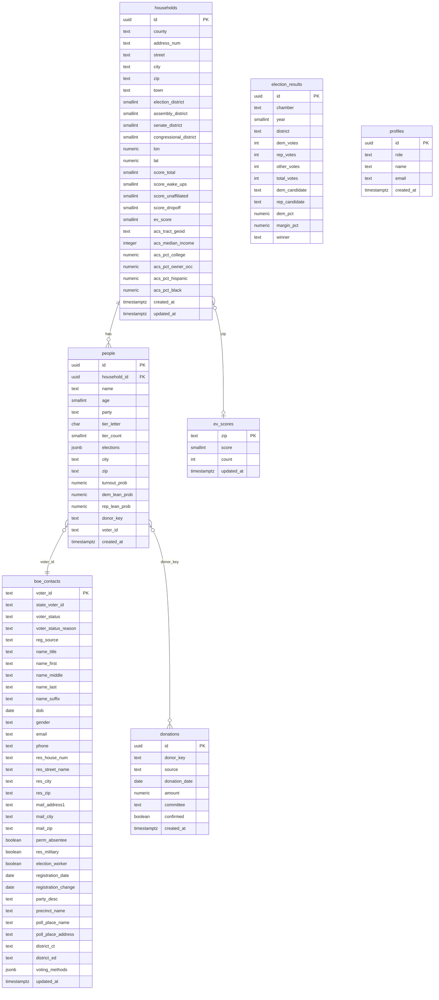

# Data Schema

## Notes

- `people.donor_key` is a generated column (`NAME|CITY|ZIP5`) used as a soft join key against `donations.donor_key` — no FK constraint.
- `people.voter_id` soft-links to `boe_contacts.voter_id` (no FK constraint).
- `households.zip` soft-links to `ev_scores.zip` for early-voting propensity lookup.
- `profiles.id` is a hard FK to `auth.users.id` (Supabase auth).
- `election_results` is a standalone reference table — no FK joins to voter data.
