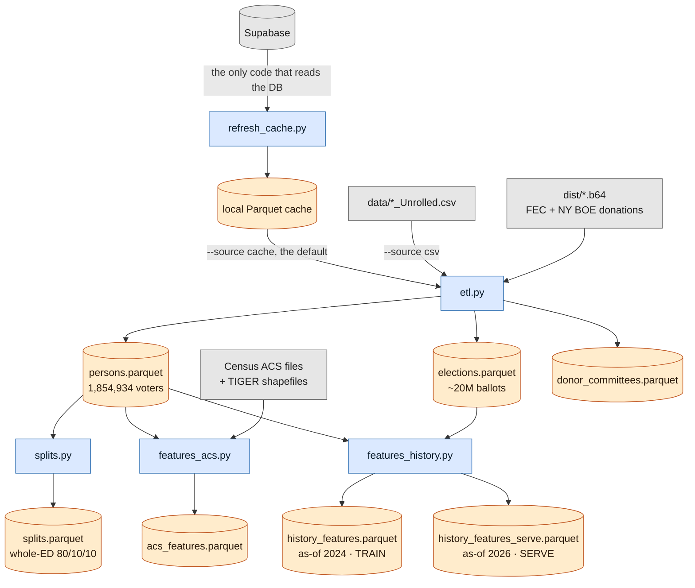
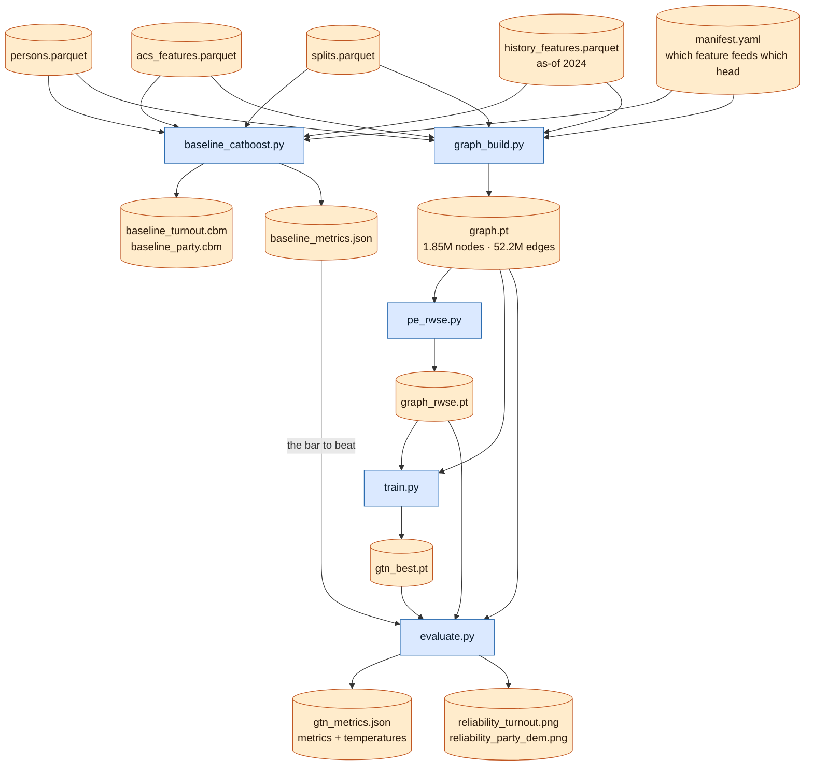
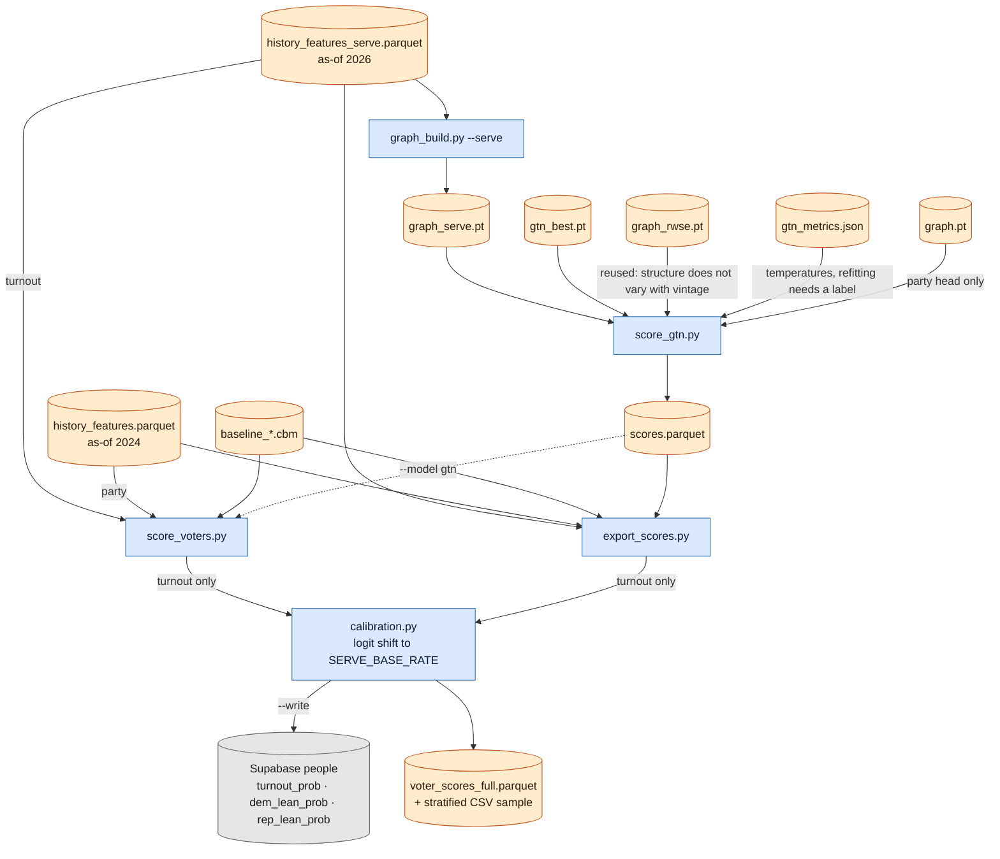
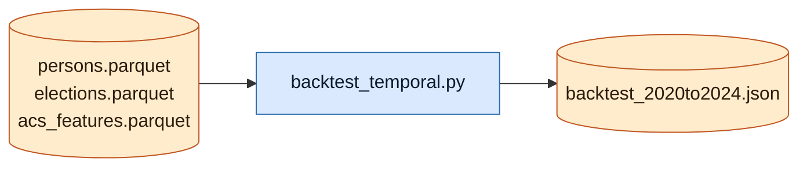

# GTN voter model

Implements `graph_transformer_research.md`: a GraphGPS (GPSConv) multi-task
graph transformer predicting **turnout propensity** and **party support** for
every voter in the Nassau/Suffolk file, benchmarked against a CatBoost
baseline on identical features and splits.

## Model performance

Two models on identical features and identical splits. **CatBoost is what
serves** (`score_voters.py --model catboost`): it wins turnout and ties on
party. The GTN is the research track and a second opinion.

Numbers below are the full run of **2026-07-29** — 800 boosting iterations,
1,854,934 voters, 80/10/10 whole-ED spatial holdout, 186,782 test voters for
turnout and 137,716 for party.

### Turnout — "will this voter cast a ballot in the target general?"

| | CatBoost | GTN |
|---|---|---|
| **AUC, excluding never-voters** | **0.8886** | **0.8848** |
| AUC, all test voters | 0.8376 | 0.8204 |
| AUC, never-voter cohort alone | 0.5707 | 0.6158 |
| PR-AUC | 0.9503 | 0.9463 |
| log loss | 0.4119 | 0.5255 |
| Brier | 0.1364 | 0.1547 |
| mean predicted vs actual (excl. never-voters) | 0.774 vs 0.774 | 0.767 vs 0.774 |

Reference points: 78.9% of test voters actually turned out, a model given
nothing but age scores 0.5235, and a coin flip is 0.5.

### Party — "dem / rep / other-minor?"

| | CatBoost | GTN |
|---|---|---|
| accuracy | 0.7240 | 0.7211 |
| log loss | 0.6462 | 0.6521 |
| macro F1 | 0.4944 | 0.4952 |

Reference point: always guessing the largest class gets 0.4989. The label is
registration, so 1,363,319 voters are labeled (49.9% dem / 45.9% rep / 4.3%
other) and 491,615 unaffiliated (BLK) voters are masked in training and scored
at inference — those scores are the actual product.

### Aggregate and temporal checks

| check | result |
|---|---|
| ED turnout rate, MAE over 188 held-out EDs (GTN) | 0.081, bias −0.076 |
| ED dem-share, MAE over the same EDs (GTN) | 0.032, bias +0.001 |
| calibration error on dem probability (GTN, ECE) | 0.007 |
| train on 2020 → predict 2024, AUC excl. never-voters | 0.8794 vs 0.8865 same-year (**gap +0.0072**) |
| train on 2020 → predict 2024, ED turnout MAE | 0.030, bias +0.001 |

### Superseded, and not comparable

| Date | Turnout AUC | Party acc |
|---|---|---|
| 2026-07-22 / 07-23 | 0.9167 – 0.9232 | 80.3% |

These came from `score_voters.py`'s own models, since deleted. That
implementation had separate feature engineering with three defects —
`hist_general_rate_*` divided by the window width instead of the years the
voter was actually 18+, `hist_eligible_8` was a constant rather than per-voter,
and `ed_key` omitted assembly district so distinct EDs sharing a number were
merged. That last one mattered twice over, because `ed_key` was also the split
unit: neighbours landed on both sides of the holdout, which flatters AUC. The
higher number was an easier question, not a better model.

## How to read these numbers

**AUC** — pick one voter who turned out and one who didn't, at random. AUC is
the chance the model gave the higher score to the one who voted. 0.5 is a coin
flip, 1.0 is perfect, 0.89 means it gets that pair right about nine times in
ten. It measures *ranking only*. It is the right number for "who do I call
first" and the wrong number for "how many people will vote."

**Why two turnout AUCs, and which to quote.** The export contains only voters
with at least one lifetime ballot. So at the 2024 cutoff, a voter with no prior
history is someone whose *first ever* ballot was the 2024 general — which means
they voted, 95.9% of the time. That is a fact about who is in the file, not
about anyone's behaviour, and a model that learned it would be memorising the
export's construction. Those 153,870 voters are therefore held out of the fit
(132,609 of them are in the training split) and scored anyway, and they score
badly on purpose: AUC 0.5707, near random. **Quote 0.8886** — the model's skill
on the population it was actually fitted to. The all-voters 0.8376 is that
number diluted by a cohort no one tried to predict.

**PR-AUC 0.95 is not as impressive as it looks.** Precision-recall AUC is
measured against the base rate, and the base rate here is 78.9%. A model that
predicted 0.789 for everybody would already score around 0.79. Read it as a
sanity check, not an achievement.

**Log loss and Brier** measure being *confidently wrong*, which AUC ignores
entirely. A model can rank perfectly and still put everyone at 0.51. Lower is
better; they are the reason CatBoost is preferred over the GTN despite an AUC
gap of only 0.004 on the fitted population — 0.412 against 0.525 is a real
difference in how usable the raw probabilities are.

**Calibration is the one that matters for planning.** "Mean predicted 0.774 vs
actual 0.774" means that if you add up the scores across a list, the total is
the expected number of voters — not just a ranking. The GTN's 0.767 vs 0.774
is a slight under-prediction. On party, an ECE of 0.007 means that among voters
scored ~70% dem, close to 70% really are.

**ED-aggregate MAE** rolls individual scores up to whole election districts and
compares against the real result. Dem share is off by 3.2 points on average with
essentially no directional bias — good. Turnout is off by 8.1 points and
*always low* (bias −0.076), which is the never-voter cohort again: 14,312 test
voters scored ~0.13 who turned out at 0.959 drag every district total down. At
the serving vintage that cohort is empty, so the aggregate bias should mostly
go away — but there is no 2026 label to confirm it yet.

**Macro F1 0.49 alongside 72.4% accuracy** is not a contradiction. Macro F1
averages the three classes with equal weight, and the third class (registered
minor parties) is 4.3% of voters and rarely predicted correctly. Accuracy is
dominated by the two big classes; macro F1 is dominated by the small one.

**The temporal gap (+0.0072) is the honest estimate of what predicting a future
election costs.** Train on 2020, predict 2024: AUC 0.8794 against 0.8865 for a
model that got to see 2024. Losing seven ten-thousandths of AUC to a four-year
jump is small. It is the only evidence available for how the 2026 scores will
behave, because 2026 has not happened.

## How to use the scores

Three numbers per voter, in Supabase `people` and in the export file:

| column | meaning |
|---|---|
| `turnout_prob` | probability this voter casts a ballot in the **November 2026** general |
| `dem_lean_prob` | probability they are a Democratic-leaning voter |
| `rep_lean_prob` | probability they are a Republican-leaning voter |

`turnout_prob` is scored from as-of-2026 history and levelled to a midterm —
see [the served cycle](#the-served-cycle-ranking-transfers-the-level-does-not).
It is not comparable to a score for a presidential year: the same voter is
legitimately ~21 points lower here than they would be for 2024.

`dem_lean_prob`, `rep_lean_prob` and the export's `other_prob` sum to 1. The
export carries both models side by side as `cb_*` and `gtn_*`.

Current served turnout distribution, read back from Supabase after the
2026-08-01 write-back (CatBoost, history as-of 2026, levelled to a midterm; all
1,854,934 voters; mean 0.5735, median 0.631):

| score | voters | share |
|---|---|---|
| 0.8 – 1.0 | 601,002 | 32.4% |
| 0.6 – 0.8 | 384,296 | 20.7% |
| 0.4 – 0.6 | 333,203 | 18.0% |
| 0.2 – 0.4 | 182,191 | 9.8% |
| 0.0 – 0.2 | 354,242 | 19.1% |

The middle of that table is where GOTV lives, and it is much fuller than it used
to be. That is the cycle shift, not a different model: a presidential-level
score piles voters against 1.0 (the previous served file had 61.3% above 0.8),
where a midterm spreads them out. Rankings are identical either way.

Reasonable uses:

- **Rank a contact list.** Sort by `turnout_prob` and work from the top for
  persuasion, or from the middle for GOTV — a voter at 0.5 is where a knock
  moves the most probability. This is what AUC 0.889 licenses.
- **Budget by expected yield.** Because the scores are calibrated *and* levelled
  to a midterm, summing `turnout_prob` over a list gives the expected number of
  ballots from it in November 2026. 1,000 voters averaging 0.65 is ~650 expected
  votes, and you can compare two lists directly. This is the use that breaks
  without the cycle shift, and it breaks quietly — the ranking still looks right.
- **Find the unaffiliated lean.** The 491,615 BLK voters have no registration to
  read, so `dem_lean_prob` is genuinely new information there. For registered
  partisans it is mostly re-deriving a field you already have.
- **Cross the two.** High `dem_lean_prob` with mid `turnout_prob` is a GOTV
  target; high `dem_lean_prob` with high `turnout_prob` is already banked.

Things the scores will not support:

- **A hard party call from a 0.51.** Accuracy is 72%, so roughly one in four
  individual party calls is wrong. Use the probability, or a wide margin.
- **Other election types.** These are general-election turnout scores. Primary
  and special turnout behave differently and are not modelled.
- **Comparisons across runs.** Retraining shifts the scale slightly; re-score
  the whole file rather than mixing vintages in one list.
- **Anything about the never-voter cohort at the training vintage.** Their
  scores are deliberately meaningless there. This is why the pipeline now serves
  on 2026 history, where the cohort is empty.

Two provenance flags in the export, `held_out_of_turnout_fit` and
`party_label_masked`, mark voters whose scores need the caveats above. Note that
`held_out_of_turnout_fit` is computed on whichever history vintage was scored,
so at the 2026 serving vintage it is zero for everybody — the 132,609 voters
held out of the *fit* were held out at the 2024 cutoff, and that fact is not
carried into the serving file.

## End-to-end flow

Three phases. Rounded blue boxes are scripts you run, tan cylinders are files on
disk, grey boxes are things outside this repo. Every file lands in
`config.ARTIFACTS`, outside the repo — see the PII note below.

### Phase 1 — build the person table



`refresh_cache.py` sits outside `run_pipeline.sh` — the Pipeline section below
says why. `features_history.py` is the one stage that writes two files, which is
the pivot the rest of the pipeline turns on; see
[Two feature vintages](#two-feature-vintages-one-to-train-on-one-to-serve).

### Phase 2 — train both models



Both models read the same `manifest.yaml` and the same `splits.parquet`, which
is what makes the head-to-head in `gtn_metrics.json` a fair comparison rather
than two numbers that happen to sit next to each other.

### Phase 3 — score and serve



The two dashed-in alternatives are the model choice: `score_voters.py` serves
CatBoost by default and the GTN's `scores.parquet` with `--model gtn`.
`export_scores.py` takes both at once, which is what makes it useful for
eyeballing a disagreement.

Note the vintage split in this phase — turnout is scored from as-of-2026
history, party from as-of-2024 — and that `score_gtn.py` pulls from *three*
training-phase artifacts it cannot recompute: the checkpoint, the RWSE, and the
temperatures.

### Off to the side



`backtest_temporal.py` recomputes history features at a 2020 cutoff and predicts
2024, which is the only measurement of what predicting a *future* election
costs. It is not a pipeline stage because nothing downstream consumes it.

### Ancillary code

Modules that are imported rather than run. These are where the invariants live,
which is why there is exactly one copy of each.

| module | role | imported by |
|---|---|---|
| `config.py` | every path and constant; `pii_dest()` refuses to write PII inside the repo; `manifest_spec()` | everything |
| `manifest.yaml` | the feature list with `usage` / `as_of` / `spans_cutoff` / `format` tags — the single source of truth for which feature reaches which head | `config`, and through it both models |
| `persons_io.py` | the one loader for the person table; writes and verifies the population fingerprint that keeps side files from joining the wrong voter's rows | most stages |
| `catboost_util.py` | manifest-driven feature selection, the leakage guards, and the shared fit/eval helpers | `baseline_catboost`, `backtest_temporal`, `export_scores`, `score_voters` |
| `sources.py` | raw source frames from cache / CSV / `.b64`, including donation date filtering | `etl` |
| `features_person.py` | raw frames to the flat person table: household aggregates, leave-self-out shares, party folding | `etl` |
| `splits.py` | also a library — `load_split_labels()` validates the split table before mapping | `baseline_catboost`, `graph_build`, `backtest_temporal` |
| `db.py` | the one way to open a Supabase connection | `refresh_cache`, `score_voters` |
| `gtn.py` | the GraphGPS model definition | `train`, `evaluate`, `score_gtn` |
| `train.py` | also a library — `build_cluster_batches()` and the checkpoint path | `evaluate`, `score_gtn` |

## Pipeline (run in order)

```
pip install -r model/requirements.txt

python model/refresh_cache.py     # Supabase -> local Parquet cache (the ONLY
                                  #   thing that reads the DB; slow, resumable)
python model/etl.py               # households -> persons.parquet (~1.9M rows)
                                  #            + elections.parquet (~20M ballots)
python model/splits.py            # whole-ED 80/10/10 spatial holdout
python model/features_acs.py      # Census block-group demographics join
python model/features_history.py  # as-of-cutoff vote-history features (BOTH vintages)
python model/baseline_catboost.py # the bar to beat -> baseline_metrics.json
python model/graph_build.py       # 5-edge-type graph -> graph.pt
python model/pe_rwse.py           # random-walk PE -> graph_rwse.pt
python model/train.py             # GPSConv training -> gtn_best.pt
python model/evaluate.py          # calibration, head-to-head -> gtn_metrics.json
python model/graph_build.py --serve # same structure, as-of-2026 features
python model/score_gtn.py         # served GTN scores -> scores.parquet
```

Or `bash model/run_pipeline.sh` for the whole thing with per-stage logs
(`--from`/`--to` to resume, `--quick` for a smoke run, `--list` for stage names).
`--quick` writes to the same paths a full run does — 150 boosting iterations
instead of 800, over the top of `baseline_turnout.cbm`, `baseline_party.cbm` and
`baseline_metrics.json`. Nothing downstream can tell the difference, so re-run
the baseline in full before any `score_voters.py --write`.
`refresh_cache.py` is deliberately NOT a stage: it is slow and timeout-prone, so
it is run on purpose rather than on every pipeline run. `etl.py --source`
defaults to `cache`; pass `--source csv` to build from `data/*_Unrolled.csv`
instead.

Three scripts sit outside the ordered pipeline:

```
python model/backtest_temporal.py # train on 2020, predict 2024 (transfer gap)
python model/export_scores.py     # scored voter file for eyeballing (PII; writes
                                  #   to config.SCORES_DIR, outside the repo)
python model/score_voters.py      # dry run; --write to update Supabase
```

Self-checks, none of which need the database or a built pipeline:

```
python model/test_features_history.py   # as-of feature semantics
python model/test_features_person.py    # household aggregates, shares, labels
python model/test_persons_io.py         # stamped side files, feature vintages
python model/test_splits.py             # split-label coverage and validation
python model/test_catboost_util.py      # categorical rendering, leakage guards
python model/test_sources.py            # donation date parsing
python model/test_config.py             # PII destination rules
python model/test_refresh_cache.py      # atomic cache dump
```

Every artifact lands in `config.ARTIFACTS`, which is **outside this repo** —
`C:\data\rock_the_vote_artifacts` by default, beside the Supabase cache. It is
not in the repo because `persons.parquet` carries names, addresses, ages and
party registration for ~1.85M people, every other artifact joins back to it on
`person_row`/`person_id`, and this tree is OneDrive-synced. Set `RTV_PII_ROOT`
to relocate both; `config.pii_dest()` refuses any path inside the repo and fails
at import, so a misconfigured root stops the pipeline rather than leaking.

Smoke-test any stage on a subset with
`python model/etl.py --county NASSAU --city "GLEN COVE"` and pass the `*_smoke`
artifacts through the later stages with `--persons/--graph`.

`features_acs.py` and `features_history.py` derive side files rather than
mutating `persons.parquet`, and each is stamped with a fingerprint of the
persons table it came from. `persons_io.load_persons()` verifies that stamp and
refuses a mismatch, naming the stage to rerun. This matters because `person_id`
and `person_row` are row ordinals: two different populations of the same size
share every id, so a length check cannot tell a current side file from a stale
one — it would join a voter's row to a different voter's features in silence.

## Two feature vintages: one to train on, one to serve

`features_history.py` writes **two** files with identical feature columns:

| file | cutoff | used by |
|---|---|---|
| `history_features.parquet` | `TARGET_GENERAL_YEAR` (2024) | training — the label is observed there |
| `history_features_serve.parquet` | `SERVE_GENERAL_YEAR` (2026) | scoring — the election being predicted |

Training needs features and label to share a cutoff, or the outcome leaks into
the features. Serving needs the opposite: history as-of the election you are
actually predicting. Using the training vintage for both was a real defect —
153,870 voters whose first ballot *was* the 2024 general were scored on history
that predated it, giving mean `turnout_prob` 0.115 against an observed 0.959.
At the serving vintage that cohort is empty and they score ~0.808.

The two files are indistinguishable by content, so each carries a
`history_target_year` stamp and `baseline_catboost.py`/`graph_build.py` refuse a
mismatch — training on the serving vintage would be total leakage.

**The two heads take different vintages, and it is not symmetric.** `y_turnout`
is the target election's outcome, so training pairs features and label at one
cutoff and serving asks the same question about a later election — the serving
vintage is right. `y_party` is the registration snapshot *already in the file*,
so training already pairs training-vintage features with a present-day label,
and scoring it at a later vintage is a pairing nothing ever fitted or validated.
Measured against the known registration split (true dem share 0.5210):

| | implied dem share | error |
|---|---|---|
| party head at the training vintage | 0.5266 | +0.0056 |
| party head at the serving vintage | 0.4777 | −0.0433 |

Eight times the error, and enough to flip the file's aggregate lean. Registration
does not move with the history cutoff, so the later vintage buys the party head
nothing. `score_persons` and `score_gtn.py` therefore serve **turnout from the
serving vintage and party from the training one**.

`backtest_temporal.py` is what measures the cost of predicting one year from
another's model: currently **+0.0072 AUC**. Note there is no 2026 label yet, so
the serving vintage cannot be validated against outcomes — only reasoned about
from that transfer gap.

## The served cycle: ranking transfers, the level does not

The right vintage still leaves the wrong *level*. The turnout head is fitted on
2024, a presidential year; it is served for November 2026, a gubernatorial
midterm. Those differ by about 21 points of turnout in this file no matter who
is likely to vote, measured with the eligibility rule in `features_history`:

| year | cycle | turnout |
|---|---|---|
| 2014 | midterm | 0.3152 |
| 2016 | presidential | 0.6790 |
| 2018 | midterm | 0.5391 |
| 2020 | presidential | 0.7818 |
| 2022 | midterm | 0.5735 |
| 2024 | presidential | 0.7834 |

`backtest_temporal` shows the two halves come apart cleanly. Same cycle type
(2020 → 2024) transfers both ranking and level: AUC 0.848, ED bias +0.5 pt.
Across cycle types (2022 → 2024) the ranking still transfers — AUC 0.855, the
best of any single year — while the level collapses, ED bias −24.2 pts. That is
also why the model trains on 2024 rather than the cycle-matched 2022: **recency
wins ranking** (predicting 2022, training on 2020 beats training on 2018,
0.8716 vs 0.8659), and the level is fixable separately.

So it is fixed separately. `calibration.py` solves for one additive offset in
logit space such that the mean served probability equals
`config.SERVE_BASE_RATE`, anchored to **2022 (0.5735)** — the most recent NY
gubernatorial midterm, the same office cycle as 2026. Being monotone in `p`, the
shift cannot reorder two voters: AUC, PR-AUC and every rank-based targeting
decision are identical before and after. What it restores is the additive
reading — summing `turnout_prob` over a list estimates a ballot count again.

Applied by `score_voters.py` and `export_scores.py` together, so the database and
the export cannot drift apart, and only when scoring the serving vintage —
asking for the training vintage is a request to reproduce training numbers.
`--base-rate 0` serves the fitted level unshifted.

Two caveats worth keeping in view. The anchor is a forecast, not a measurement:
midterm turnout here has been rising (0.539 → 0.574), so 2022 is mildly
conservative for a high-salience 2026, and `SERVE_BASE_RATE` is the one number
to change. And the shift moves the whole distribution — it is calibrated in
aggregate, not conditionally, so it does not claim that every subgroup drops by
the same amount. Once 2026 history exists, set `TARGET_GENERAL_YEAR = 2026`,
retrain against the real label, and drop the anchor.

Donation features are a known gap: they are cut at the ETL's donation cutoff
(`election_day(TARGET_GENERAL_YEAR)`) and so remain as-of 2024 in **both**
vintages. They do not appear in the turnout model's top-12 importances, but a
donor who first gave in 2025 looks like a non-donor at serving time.

## Labels (and the leakage rule)

- **Turnout propensity** = actually voted in the target general
  (`config.TARGET_GENERAL_YEAR`, currently 2024). Voters not yet 18 by that
  election carry `y_turnout = -1` and are masked from training and metrics
  (they still get scored). Voters with no ballots before the target general are
  scored but held out of the turnout *fit*: the export contains only voters with
  ≥1 lifetime ballot, so "no prior history" mechanically implies "voted E"
  (P = 0.959) — a property of who is in the file, not of anyone's behaviour.
  The leakage rule is temporal: everything the turnout task sees must
  be as-of the target general (`as_of` in `manifest.yaml`); export-computed
  summaries that span the cutoff (`tier_*`, vote-count aggregates, and the
  household canvass `score_*` columns derived from them) are marked
  `spans_cutoff` and asserted out of the turnout task. Donation features and
  co-donor edges are date-filtered to before election day in `sources.py`.
  `manifest.yaml` is the single source of truth both models read; nothing
  hardcodes feature lists. `python model/test_features_history.py` pins the
  as-of semantics with synthetic voters.
- **Party support** = 3 classes folding NY fusion parties (DEM+WOR / REP+CON /
  other minor). Registration is the training label, so it is *excluded* from
  the party task's features; unaffiliated (BLK) voters are masked in training
  and scored at inference — they are the product output.
- Household/ED party-share features are computed excluding self.

## Vote history (the `*_Unrolled` files)

`etl.py --source csv` reads `data/*_Unrolled.csv`, whose `household_detail` carries every
voter's full per-election history (~1999-present, GENERAL + PRIMARY, with
vote method). It lands in `elections.parquet` (person_row, year, etype,
method), and `features_history.py` turns it into `hist_*` features computed
**as of the target general E** (`config.TARGET_GENERAL_YEAR`): only ballots
from years < E plus the year-E primary. It also writes `y_voted_general_E` —
the real turnout outcome.

`hist_*` features feed the shared encoder (y_turnout is the real year-E
outcome, so they are legitimate for both tasks). Exceptions: pure
primary-participation features are `turnout_head`-only — NY primaries are
closed, so BLK voters (the party task's scoring population) structurally
cannot have them — and the leave-self-out household/ED rate aggregates stay
heads-only like the registration shares. `backtest_temporal.py` measures the
question that matters for 2026: train on one general, predict the next
(donation features excluded there — they are as-of the config target only).
To score the 2026 general, set `TARGET_GENERAL_YEAR = 2026` and rerun the
pipeline: every feature then uses history through the 2026 primary, and the
label column is vacuously zero (the election hasn't happened).

History caveats: coverage starts ~1999 and only includes ballots cast while
registered in-county (movers' rates are understated); ages are as of the
export date and get de-aged per election year; `tier_count` is a lossy
summary of this history (corr ~0.7 with true lifetime ballots).

## Graph

Person nodes (parquet row order). Edge types, coalesced by priority:
household clique (capped at 10 — larger records are facilities and get
sampled peers), same-address, donation co-occurrence (conduits like ActBlue
excluded; committees capped at 5k donors), spatial kNN over household points,
sampled ED peers. Training clusters are whole EDs snake-ordered by lat/lon
(~8k persons each) — ClusterGCN-style, chosen because this machine
(Windows-on-ARM, CPU-only torch) can't run pyg-lib/torch-sparse samplers.
RWSE is exact within each cluster (sparse-CSR power iteration).

## Model

`gtn.py`: encoder = numeric features + categorical embeddings + RWSE
projection -> 3x GPSConv(GINEConv, performer attention, edge-type embedding).
Two heads: turnout (+ own-party embedding), party (+ tier features). BCE +
masked CE, equal weights. `train.py` early-stops on val loss;
`evaluate.py` applies per-head temperature scaling fitted on val, reports
test metrics, ED-aggregate MAE (predicted vs actual rates on held-out EDs) and
reliability diagrams, and stores the fitted temperatures in `gtn_metrics.json`.
`score_gtn.py` then reuses those temperatures — there is no 2026 label to refit
on — and writes `scores.parquet` with calibrated probabilities for all
~1.85M voters. The two are separate because evaluating needs labels and scoring
needs the serving vintage, and only one of those can be true at a time.

## Data notes

- Donation features/edges come from the committed `dist/nyboe-data.b64` and
  the `fec_donations` block inside `dist/nassau-data.b64` when the gitignored
  raw caches are absent.
- ACS comes from the keyless Census table-based summary files (the Data API
  now requires an API key).
- Geocoding reuses `build/build.py`'s TIGER interpolator; results are cached
  in `geocode_cache_*.parquet` under `config.ARTIFACTS`.
